# `ZERO-DAY ATTACK`

## _`A hacking-themed tile-laying strategy game for two players`_

`Originated at the Cardboard Jam`  
`April 9 & 10, 2011`  
`MIT Game Lab`

`Developed and owned by:`  
`Bradley Momberger`  
`Jonathon Myers (who misspelled labyrinth)`  
`Joshua A.C. Newman`  
`Jonathan Venezian`  
`© 2011, 2025`

> **Digital Implementation Note**: This rulebook describes the original physical card game with a **portrait orientation** (players seated at top and bottom, reserves above and below the grid). The Board SDK digital implementation uses a **landscape orientation** (1920×1080 display, players seated left and right, reserves beside the grid). Game mechanics remain identical; only the physical layout differs. See `BOARD-TILE-SIZING-ANALYSIS.md` for digital layout specifications.

[INTRODUCTION](#introduction)

[Theme](#theme)

[Objective](#objective)

[Summary](#summary)

[Players](#players)

[Components](#components)

[Player Tokens](#player-tokens)

[Board](#board)

[Tiles](#tiles)

[GAME SETUP](#game-setup)

[Setup And Start Of The Game](#setup-and-start-of-the-game)

[Player Token Positioning](#player-token-positioning)

[Tile Placement](#tile-placement)

[Path Segment Color Matching](#path-segment-color-matching)

[GAMEPLAY](#gameplay)

[Gameplay Summary](#gameplay-summary)

[Turns](#turns)

[Single Actions](#single-actions)

[Draw](#draw)

[Discard](#discard)

[Steal](#steal)

[Place Single Action](#place-single-action)

[Move](#move)

[Double Action Place](#double-action-place)

[GAMEPLAY PROGRESSION](#gameplay-progression)

[Phase One Attack](#phase-one-attack)

[Midpoint Event Exploit](#midpoint-event-exploit)

[Phase Two Ghost](#phase-two-ghost)

[GAME END](#game-end)

[Winning The Game](#winning-the-game)

[Counting Path Segments](#counting-path-segments)

[Settling A Tie](#settling-a-tie)

## `INTRODUCTION` {#introduction}

### **`Theme`** {#theme}

You're an elite hacker, hired by a global corporation to take down their greatest competitor. You can easily find a pathway through their firewall to plant an exploit for a zero-day attack. Simple. Only one catch. The competition just hired your nemesis to put up defenses and attack your client as well. You must simultaneously defend against their attack and hack your way through your opponent's firewall, leaving a malicious exploit so you can trigger a devastating payload. As you cover your tracks, they will try to find you and stop you. But you know how to ghost...

Who will find the best path for a Zero-Day Attack and emerge victorious in your battle for hacking supremacy?

### **`Objective`** {#objective}

Place tiles to reach the edge of the game board with a token, then move your token as far away from that location as possible.

### **`Summary`** {#summary}

The game unfolds for each player in two stages, with a midpoint event:

- Phase 1 - Breach a firewall with an **Attack** (reach the game board edge)
- Midpoint - Leave an **Exploit** behind the firewall (mark the spot)
- Phase 2 - **Ghost** with a shielded retreat (move away from the spot)

### **`Players`** {#players}

2 Players, represented by Blue and Red tokens and board seating.

### **`Components`** {#components}

#### `Player Tokens` {#player-tokens}

Each player (Red and Blue) receives:

- One (1) Attack Token
- One (1) Exploit Token
- One (1) Ghost Token

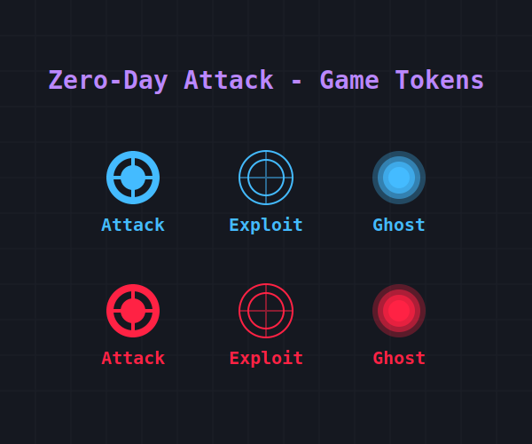  
_`Red and Blue Player Tokens`_

#### `Board` {#board}

Each square on the grid of the game board is the size of one tile. The total game board is seven (7) tile squares in height and five (5) tile squares across.

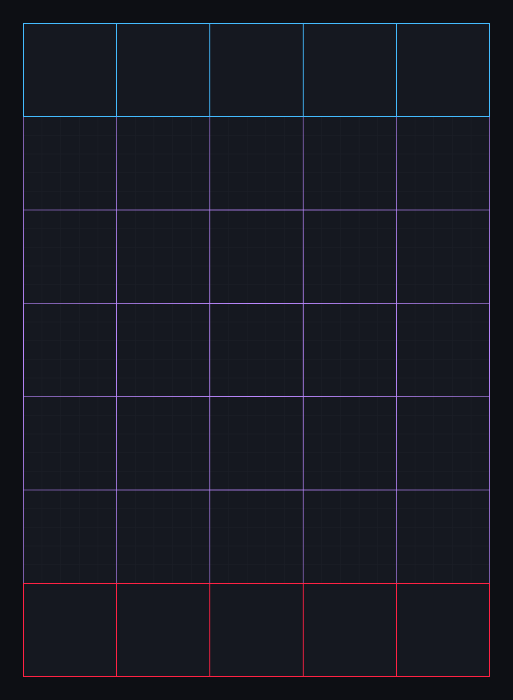

The tile placement area, surrounded by a firewall on all sides, is a five (5) by five (5) square grid consisting of 25 square tile spaces with thin Purple borders.
One (1) unique starting tile is always located at the center middle tile space. The other 24 spaces begin as empty locations where any of the other tiles may be placed into play, in any rotational position.

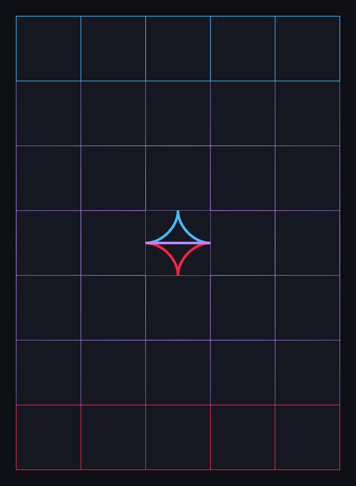

Beyond each of the top and bottom ends of the tile placement area is an additional row of five (5) empty tile spaces. These Red and Blue areas designate the player colors. During play, they serve as a reserve pool of player tiles for possible placement (or for theft by the opponent). Drawn tiles awaiting placement will reside in these reserve pool areas during play, face up and visible.

#### `Tiles` {#tiles}

There are 25 square tiles, one (1) fixed-location starting tile and another 24 tiles available for player placement. The colored path segments on a tile are lines traced between the four edge nodes of the tile sides. Tiles have different configurations of Red, Blue, and Purple path segments.  
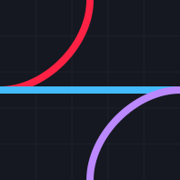
_`Example Tile`_

Each square tile has edge nodes on each of the four sides, located at the midpoint of the tile's side.

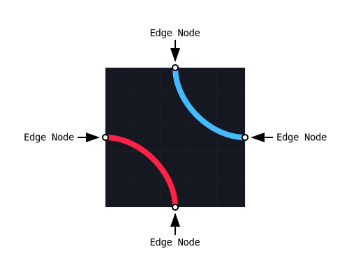

During play, tiles reside in a shuffled deck before they can be drawn by a player. After a tile is drawn, it may be placed in the playable purple grid area or positioned in the player's tile reserve pool for later placement.

## `GAME SETUP` {#game-setup}

### **`Setup And Start Of The Game`** {#setup-and-start-of-the-game}

Players determine who will go first and which color they will play, seating themselves behind the area of the board represented by their chosen color. They place the Red and Blue Attack Tokens on their starting nodes.

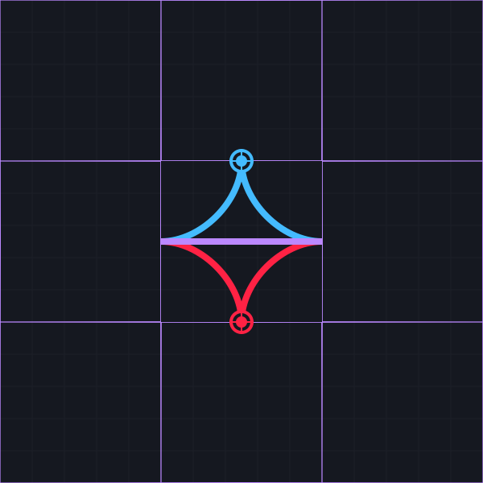  
_`Starting Nodes`_  
The players each receive five (5) tiles from the deck, and take first turns:

1. The first player chooses one (1) tile and places it to one side of the center grid space tile at a Purple node
2. The first player chooses to keep three (3) tiles, placing them in their tile pool face down. The final tile is reshuffled into the deck
3. The second player completes the same actions as the first player
4. Both players turn their three (3) tiles face up in their tile pool
5. All tiles in the tile pools remain visible to both players for the rest of the game

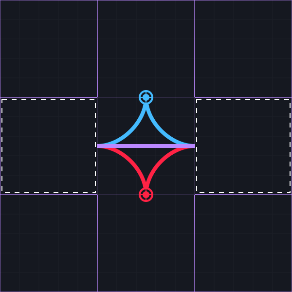
_`Initial Tile Placements`_  
Here is an example of the board after the players' starting turns.

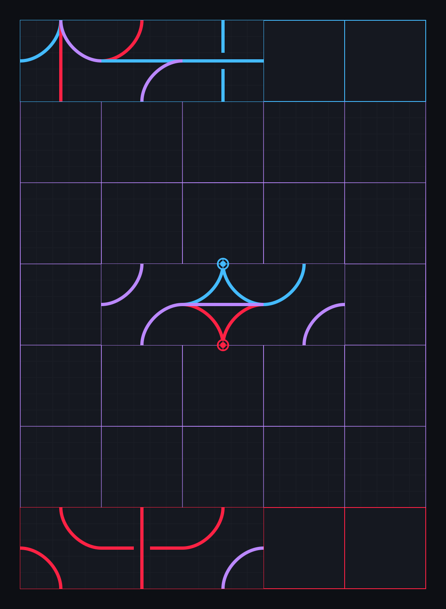

Red placed their first tile to the left of the center starting tile, discarded one tile, and placed the remaining three face up in their pool. Blue placed their first tile to the right, and did the same.

### **`Player Token Positioning`** {#player-token-positioning}

Player Tokens (Attack, Exploit, Ghost) are always located on an edge node of one of the four sides of a placed square tile. The edge node where a Player Token resides must include a path segment of a player's color, or Purple.

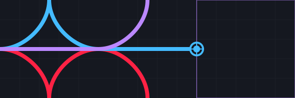
_`Attack Token Position Before Tile Placement`_

### **`Tile Placement`** {#tile-placement}

Players place tiles side by side with other tiles already positioned on the board. Once placed, a tile cannot be removed, moved, or rotated.

After placement, colored path segments of tiles connect with each other at the edge node of the sides of tiles. A Player Token must reside on a tile connected to the newly placed tile.

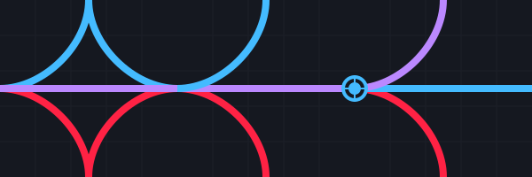
_`Tiles Connected At An Edge Node After Tile Placement`_

The placed tile must also match the path segment colors at the connecting edge node where the two tiles meet. If any other surrounding tiles on the board connect with the placed tile, they must also match the path segment colors of the placed tile.

### **`Path Segment Color Matching`** {#path-segment-color-matching}

A solitary Blue path segment and edge node cannot be matched to a solitary Red path segment and edge node, and vice-versa.

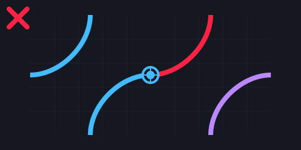  
_`No Match`_

As long as both sides of the match have either a player's color, or Purple, then it is a match.

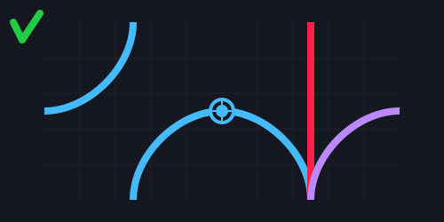

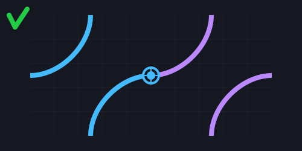

Here are the possible matches:

- Blue path segments can only match with Blue or Purple path segments of a connected tile. Red may be present at the edge node of the match and it will still match, but the player cannot move along the Red path
- Red path segments can only match with Red or Purple path segments of a connected tile. Blue may be present at the edge node of the match and it will still match, but the player cannot move along the Red path
- A Purple path segment can match to any other path segment
- If there is more than one color segment at an edge node, then it is possible for any other segment to match

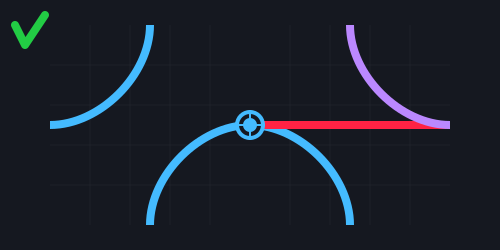
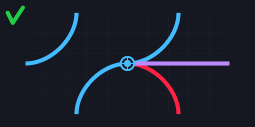
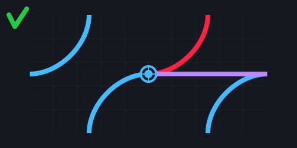

## `GAMEPLAY` {#gameplay}

### **`Gameplay Summary`** {#gameplay-summary}

As represented by the different Player Tokens, the gameplay progresses in two (2) phases, with a midpoint event.

- Phase One - Breach a firewall with an **Attack** (reach the game board edge)
- Midpoint - Leave an **Exploit** behind the firewall (mark the spot)
- Phase Two - **Ghost** with a shielded retreat (move away from the spot)

At the end of the second phase, the game is over and the players count path segments to determine a winner.

### **`Turns`** {#turns}

A complete turn consists of a player performing either two (2) Single Actions, or one (1) Double Action.

#### `Single Actions` {#single-actions}

The two (2) Single Actions may be performed in any order the player chooses. A player can perform any of the following to take a Single Action: Draw, Discard, Steal, Place, or Move.

##### `Draw` {#draw}

A player may take one (1) tile from the top of the tile deck.

##### `Discard` {#discard}

Only after the deck is empty, a player may discard one (1) tile per Single Action. Once discarded, a tile is out of play for the rest of the game. If a player discards their final tile and their tile pool is empty, the player may not complete any more actions or turns.

##### `Steal` {#steal}

A player may take one (1) tile from their opponent's tile pool.

If a player Steals two (2) tiles from an opponent in a Single Action turn, committing two (2) actions, the opponent cannot steal both tiles back. The opponent may use only one (1) action in their next turn to Steal one (1) of the previously stolen tiles.

##### `Place Single Action` {#place-single-action}

A player may place a tile on the empty side of the tile inhabited by their Token.

For a Single Action Place, the Token must reside on the edge node of a tile, and the new tile placement must be added to the same side of the inhabited tile as the Player Token's location.

Following this action, the sides of the two tiles (one newly placed) and their edge nodes must have the Player Token present.

See the above sections on Player Token Positioning, Tile Placement, and Path Segment Color Matching for rules that must be observed.

##### `Move` {#move}

When moving along paths, a player must follow these rules:

1. A player can only move along paths of their color (Red or Blue) or Purple paths
2. In a single Move action, a player must stay on the same color path (either their color or Purple)
3. If a player reaches a node where both their color and Purple paths continue forward:

   1. They must continue on the same color path they started with for that action
   2. To switch to the other color path, they must end their current Move action at that node
   3. They can then use another Move action (either in the same turn or later) to continue on the new color path

For example, a Red player moving along a Red path reaches a node where both Red and Purple paths continue forward. They must either:

- Continue along the Red path to complete their Move action, OR
- Stop at that node, ending their Move action, then use another Move action to travel along the Purple path

Players Tokens Do Not Block Each Other  
The Tokens of both players may occupy or Move through the same edge node of a path as long as other movement and position rules are observed.  
As long as a Player Token moves through path segments of only one color (theirs or Purple), they can move as far along that continuous path as they choose for that Move.

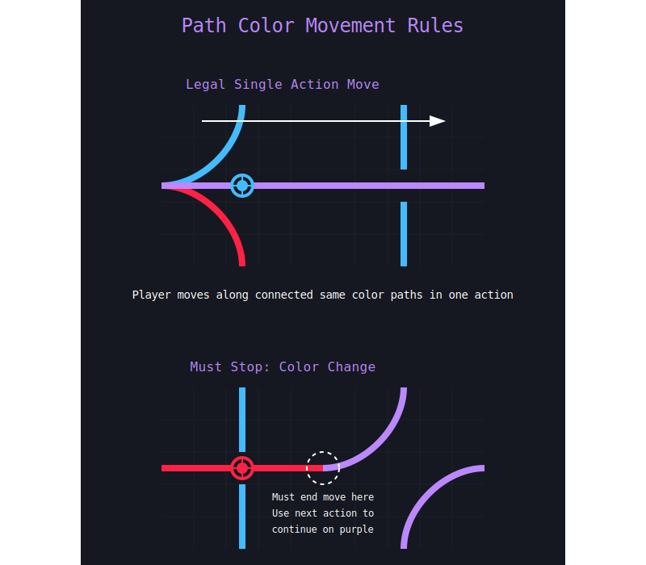

#### `Double Action Place` {#double-action-place}

Similar to a Single Action Place, the player places a tile on an empty space next to a tile with the Player Token on an edge node. In the case of a Double Action, the player may place and match the new tile to a side with an empty edge node, adjacent or across from the edge node where the Token currently resides.

If the player chooses a Double Action Place when their turn starts, then the player may not perform any other actions and their turn is over. Once a player has taken a Single Action at the start of a turn, the player may not choose a Double Action.

In the following simple example, the Blue player can place one (1) matching tile on any of these three (3) tile sides for a Double Action Place.

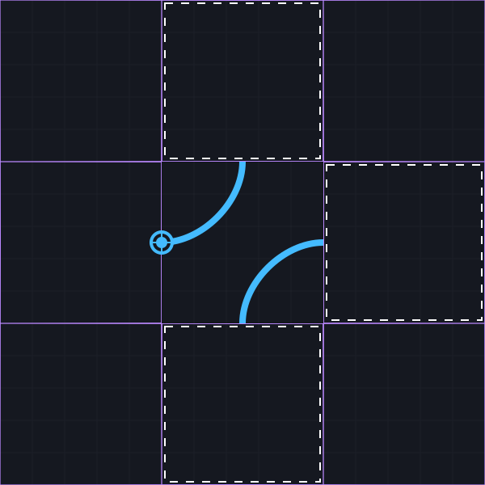  
_`Double Action Placement Options`_

### **`GAMEPLAY PROGRESSION`** {#gameplay-progression}

The gameplay progresses in two (2) distinct phases, with a midpoint event:

- Breach a firewall with an **Attack** (reach the game board edge)
- Leave an **Exploit** behind the firewall (mark the spot)
- **Ghost** with a shielded retreat (move away from the spot)

#### `Phase One Attack` {#phase-one-attack}

Players take turns using actions to place tiles and move their Attack Token. Once a player reaches the firewall (a node on the board edge), the Attack is considered successful.

#### `Midpoint Event Exploit` {#midpoint-event-exploit}

When a player's Attack Token reaches a firewall node (board edge):

- The Attack Token is immediately replaced with their Exploit Token
- This replacement does not count as an action
- If the player has another action remaining in their turn, they take it
- The Exploit Token remains at this node for the rest of the game

#### `Phase Two Ghost` {#phase-two-ghost}

After placing their Exploit Token:

- The player uses their next Move action to deploy their Ghost Token:

1. The player places the Ghost Token at the Exploit Token's node
2. The player moves the Ghost Token away from the Exploit Token in the same Move action

- The Ghost Token follows the same standard movement rules
- The player continues with placement and movement actions in a shielded retreat, until they can move no further, or the game is over

## `GAME END` {#game-end}

The game ends with the conclusion of these three sequential events:

1. The deck is empty
2. One player ends their own turn with no tiles
3. The other player takes one final turn

### **`Winning The Game`** {#winning-the-game}

At the end of the game, the player with the most segments of their own color between their Exploit Token and their Ghost Token wins.

#### `Counting Path Segments` {#counting-path-segments}

When counting segments between their Exploit and Ghost tokens:

- Players select the valid path with the most segments of their color
- Each path segment can only be counted once in the selected path
- Each path segment can only be traversed once in the selected path

A path segment is defined as either:

- One quarter-circle path of the player's color
- One straight line path of the player's color

Note: If a player's token crosses the starting tile using two quarter-circle segments of their color, this counts as two segments toward their total.

#### `Settling A Tie` {#settling-a-tie}

In the event of a tie, the player with the most Purple segments along their path wins.

In the following scenario, the Red and Blue players have played all available tiles. The Red player has 12 red tile segments between their Exploit and their Ghost. The Blue player has 13 blue tile segments, and so they win.

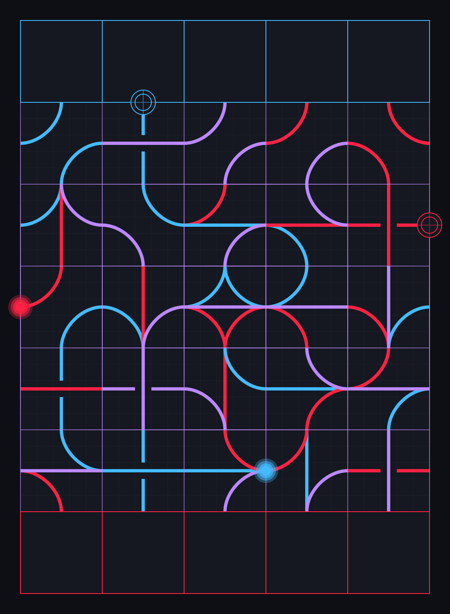
